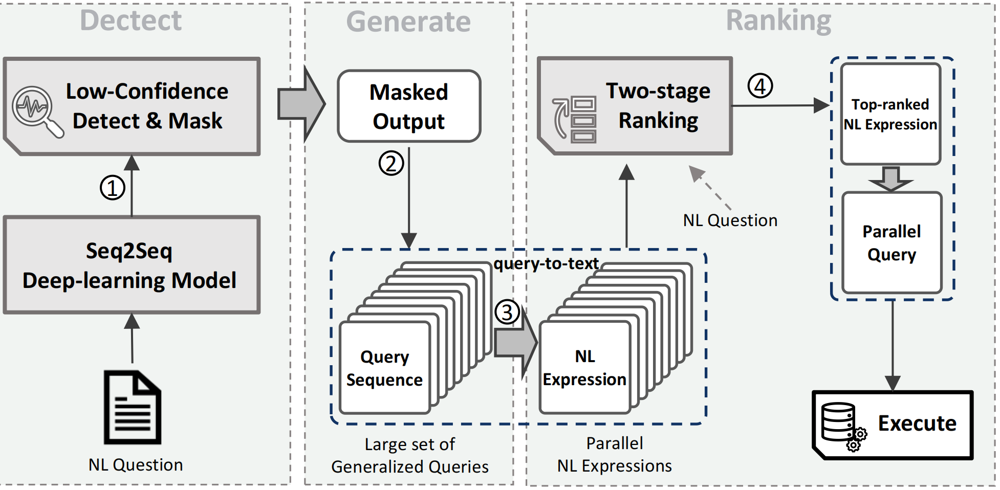

---

##### Download

+ [Paper](paper2.pdf)
<!-- + [Code and data](https://github.com/pmichaillat/feru) -->

---

##### Abstract

Recent advancements in TableQA leverage sequence-to-sequence (Seq2seq) deep learning models to accurately respond to natural language queries. These models achieve this by converting the queries into SQL queries, using information drawn from one or more tables. However, Seq2seq models often produce uncertain (low-confidence) predictions when distributing probability mass across multiple outputs during a decoding step, frequently yielding translation errors. To tackle this problem, we present CKIF, a confidence-based knowledge integration framework that uses a two-stage deep-learning-based ranking technique to mitigate the low-confidence problem commonly associated with Seq2seq models for TableQA. The core idea of CKIF is to introduce a flexible framework that seamlessly integrates with any existing Seq2seq translation models to enhance their performance. Specifically, by inspecting the probability values in each decoding step, CKIF first masks out each low-confidence prediction from the predicted outcome of an underlying Seq2seq model. Subsequently, CKIF integrates prior knowledge of query language to generalize masked-out queries, enabling the generation of all possible queries and their corresponding NL expressions. Finally, a two-stage deep-learning ranking approach is developed to evaluate the semantic similarity of NL expressions to a given NL question, hence determining the best-matching result. Extensive experiments are conducted to investigate CKIF by applying it to five state-of-the-art Seq2seq models using a widely used public benchmark. The experimental results indicate that CKIF consistently enhances the performance of all the Seq2seq models, demonstrating its effectiveness for better supporting TableQA.

---

##### Figure 2: The Workflow of CKIF



---

##### Citation

Fan Y., Ren T., Huang C., Zheng B., Jing Y., He Z., Li J., Li J. (2024) "A Confidence-based Knowledge Integration Framework for Cross-Domain Table Question Answering", *Knowl. Based Syst* pages 112718.


Yuankai Fan, Tonghui Ren, Can Huang, Beini Zheng, Yinan Jing, Zhenying He, Jinbao Li, Jianxin Li:
A confidence-based knowledge integration framework for cross-domain table question answering. Knowl. Based Syst. Volume 306: 112718 (2024)

```BibTeX
@article{ckif2024,
author = {Yuankai Fan, Tonghui Ren, Can Huang, Beini Zheng, Yinan Jing, Zhenying He, Jinbao Li and Jianxin Li},
year = {2024},
title ={A Confidence-based Knowledge Integration Framework for Cross-Domain Table Question Answering},
journal = {Knowl. Based Syst.},
volume = {306},
pages = {112718}
}
```

---

##### Related material

<!-- + [Presentation slides](presentation1.pdf) -->
<!-- + [Summary of the paper](https://www.penguinrandomhouse.com/books/110403/unusual-uses-for-olive-oil-by-alexander-mccall-smith/) -->
