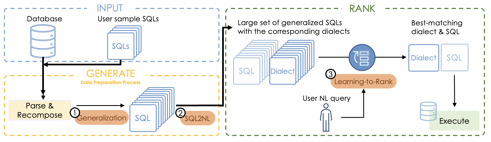

---

##### Download

+ [Paper](paper4.pdf)
<!-- + [Code and data](https://github.com/pmichaillat/feru) -->

---

##### Abstract

A Natural Language (NL) Interface to Databases (NLIDB) aims to help end-users access databases. State-of-the-art approaches primarily construct language translation models to convert NL queries to SQL queries. While these models exhibit good performance on NLIDB benchmarks, the translation accuracy seems to have stalled at between 70%-75%, and most erroneous translations happen with complex queries that require an understanding of the structure and semantics specific to a database. This paper proposes a Generate-And-Rank approach called Gar. Gar assumes that a set of sample SQL queries is given to represent the possible user-intended queries to the database. In order to provide a broad coverage, akin to avoiding over-fitting, Gar extracts the basic components from the sample set to form the basic building blocks to generate a set of generalized SQL queries. By leveraging a simple rule-based SQL to NL technique, a less natural NL expression called a dialect expression for each sample and generalized SQL query is obtained. Finally, a learning-to-rank method is used for a given NL query to retrieve the best dialect expression and hence the resulting SQL query. Extensive experiments are performed to study Gar in comparison with other approaches. The results show that Gar achieves better performance on the NLIDB benchmarks, including in particular a 78.5% translation accuracy on the popular Spider benchmark, outperforming the best reported accuracy in the literature. An extension to Gar, called Gar-j, is further introduced to aid the translation by annotating join semantics in the sample queries. The experimental results show that Gar-j can further improve translation accuracy on queries with joins.

---

##### Figure 2: Overview of MetaSQL



---

##### Citation

Fan Y., He Z., Ren T., Guo D., Chen L., Zhu R., Chen G., Jing Y., Zhang K., Wang X.S. (2023) "GAR: A Generate-and-Rank Approach for Natural Language to SQL Translation", *International Conference on Data Engineering* pages 110--122.

```BibTeX
@article{gar2023,
author = {Yuankai Fan, Zhenying He, Tonghui Ren, Dianjun Guo, Lin Chen, Ruisi Zhu, Guanduo Chen, Yinan Jing, Kai Zhang and X.Sean Wang},
year = {2023},
title ={{GAR}: A Generate-and-Rank Approach for Natural Language to SQL Translation},
journal = {International Conference on Data Engineering},
pages = {110--122}}
```

---

##### Related material

+ [Presentation slides](presentation4.pdf)
+ [Presentation Video](https://youtu.be/KLPuQmgHxUY)
